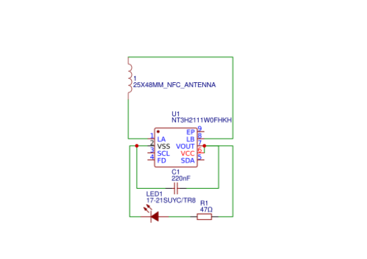
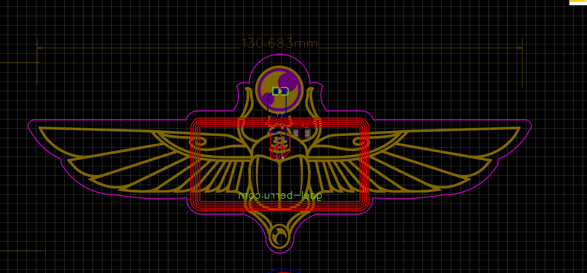
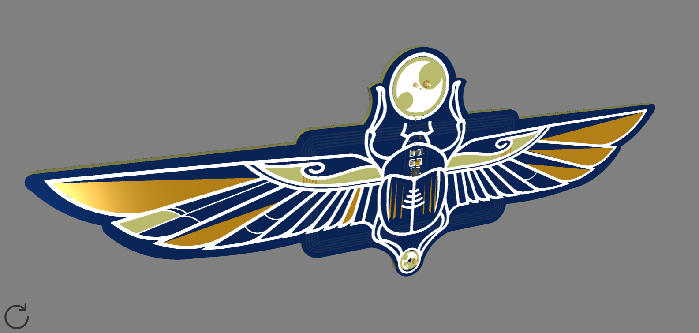
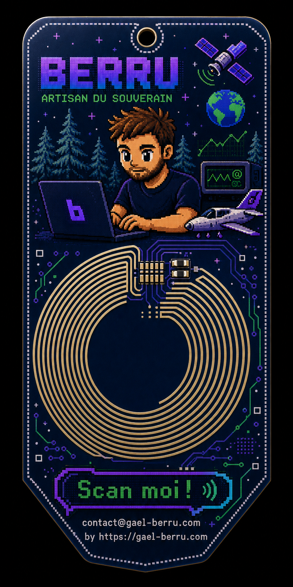
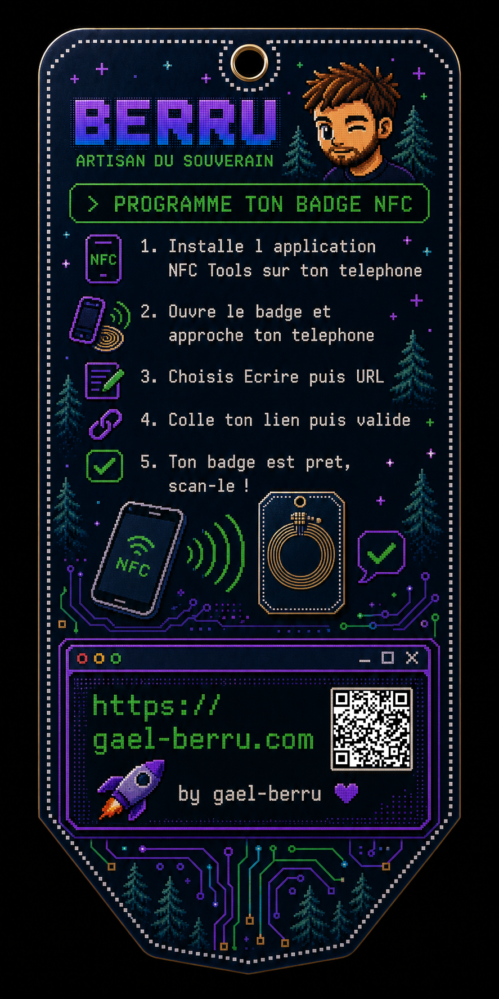

# Badge/Broche NFC

    Le NFC permet d'échanger des données* entre deux appareils sur une distance très courte, moins de 10 centimètres. Est basé sur l'induction magnétique.

## Trois composants, aucune source d'alimentation, reprogrammable à l'infini.

 
    **Schema NT3H2111**

Le [NT3H2111](https://www.taydaelectronics.com/datasheets/files/A-3652.pdf) a une mémoire EEPROM dz 1kb (1024 bytes) soit une url longue avec parametre &utm integrée, pouvant contenir un identifiant unique (UID) et un mot de passe ou API key pour sécuriser l'accès. Il est compatible avec les smartphones et tablettes équipés de la technologie NFC.

[L'antenne à calibrer](https://eds.st.com/antenna/#/)

## Utilité :
- Communication sans contact
- Stockage de données (logistique, identification, paiement)
- Suivi d'objets (étiquettes intelligentes, traçabilité)  
- Sécurité (authentification, contrôle d'accès)
- Santé (cartes d'identité, dossiers médicaux pour nos anciens ? 🤷‍♂️)

    **création d'une broche**

    **Version Color full avec la version pro**

    **Format badge**

## Comment programmer ton NFC :
1 install NFC Tool sur smartphone
2 colle ton url et valide

    **Met le lien de ton site dans ton badge nfc**